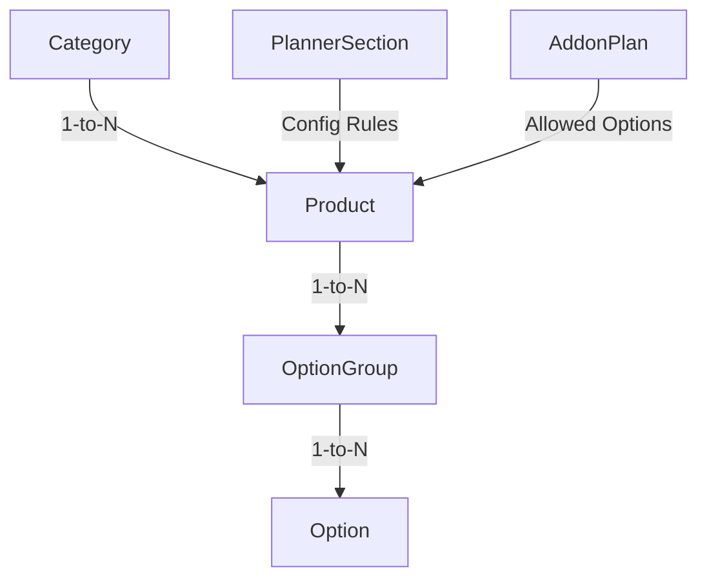

# Menu System Dashboard User Stories + Source Map

## 0. Purpose

This document serves as a comprehensive dashboard-facing handoff guide for implementing and understanding the BasicDiet145 Menu Catalog, One-Time/Direct Products, Customizable Products, Option Groups, Options, Publishing Lifecycle, and Subscription Planner Upgrades.

The core architecture follows a strict boundary separation:
* **Dashboard edits config/data:** Dashboard provides editorial interfaces and configuration panels to mutate the catalog and planning configurations in the database.
* **Backend validates:** Backend service layers validate the integrity, requirements, relationships, and prices of the menu options and configurations.
* **Backend publishes:** Backend manages drafts, publishes active revisions, and tracks catalog history/versions.
* **Flutter consumes:** Mobile client apps read published configurations and render the menu/planner directly.
* **No Client Calculations:** Flutter does not calculate pricing or balances; it displays values computed and resolved by the backend.

---

## 1. Global Source Map

| System Area | Contract / Documentation File | Backend Service / Config File | Verification / Integration Test File |
| :--- | :--- | :--- | :--- |
| **Global Overview** | [00_OVERVIEW.md](00_OVERVIEW.md) [README.md](README.md) [HANDOFF_SUMMARY.md](HANDOFF_SUMMARY.md) | N/A | N/A |
| **UI Route Mapping** | [DASAHBOARD_SCREEN_AND_ROUTES_MAP.md](DASAHBOARD_SCREEN_AND_ROUTES_MAP.md) | N/A | N/A |
| **Menu Catalog Overview** | [11_MENU_CATALOG.md](11_MENU_CATALOG.md) | `src/services/catalog/CatalogService.js` | `tests/dashboardMenuProductCenteredContract.test.js` `tests/dashboardSubscriptionMenuReadiness.test.js` |
| **Menu Categories** | [11A_MENU_CATEGORIES.md](11A_MENU_CATEGORIES.md) | `src/services/catalog/CatalogService.js` | `tests/dashboardMenuProductCenteredContract.test.js` |
| **Menu Products** | [11B_MENU_PRODUCTS.md](11B_MENU_PRODUCTS.md) | `src/services/catalog/CatalogService.js` | `tests/dashboardMenuProductCenteredContract.test.js` |
| **Product Customization** | [11C_MENU_PRODUCT_CUSTOMIZATION.md](11C_MENU_PRODUCT_CUSTOMIZATION.md) | `src/services/catalog/CatalogService.js` | `tests/dashboardMenuProductCenteredContract.test.js` |
| **Option Groups** | [11D_MENU_OPTION_GROUPS.md](11D_MENU_OPTION_GROUPS.md) | `src/services/catalog/CatalogService.js` | `tests/dashboardMenuProductCenteredContract.test.js` |
| **Options** | [11E_MENU_OPTIONS.md](11E_MENU_OPTIONS.md) | `src/services/catalog/CatalogService.js` | `tests/dashboardMenuProductCenteredContract.test.js` |
| **Preview & Releases** | [11F_MENU_PREVIEW_RELEASE.md](11F_MENU_PREVIEW_RELEASE.md) | `src/services/catalog/CatalogService.js` | `tests/verify_menu_fixes.test.js` |
| **Planner Upgrades** | [11G_SUBSCRIPTION_PLANNER_UPGRADES_DASHBOARD_README.md](11G_SUBSCRIPTION_PLANNER_UPGRADES_DASHBOARD_README.md) | `src/services/subscription/mealBuilderConfigService.js` `src/config/mealPlannerContract.js` | `tests/dashboardSubscriptionPlannerConfig.test.js` `tests/subscriptionPlannerDashboardToFlutter.e2e.test.js` `tests/dashboardMealBuilderRegression.test.js` |
| **Add-ons** | [05_ADDONS.md](05_ADDONS.md) [07_SUBSCRIPTIONS.md](07_SUBSCRIPTIONS.md) | `src/services/subscription/mealBuilderConfigService.js` | `tests/subscriptionPlannerDashboardToFlutter.e2e.test.js` |
| **One-Time Orders** | [08_ONE_TIME_ORDERS.md](08_ONE_TIME_ORDERS.md) | N/A | `tests/oneTimeOrders.test.js` (not confirmed in current contract tests) |

---

## 2. Menu Catalog User Story

### User Story
As an Admin, I want to manage the menu catalog hierarchy, category assignments, products, option groups, and option relationships,
So that customers can see and customize available menu items when making subscription choices or one-time orders.

### Dashboard Action
* Implement a multi-tab interface under `/menu` mapping:
  * **Categories:** Read, create, edit, drag-and-drop reorder, toggle availability, and bulk assign products.
  * **Products:** Read, create, edit, duplicate, and toggle availability.
  * **Option Groups:** Manage reusable library option groups.
  * **Options:** Manage individual selectable customization choices.
  * **Preview & Release:** Render the mobile preview, check validation errors, view differences, publish draft updates, and rollback versions.

### Source Map
| Type | File Path |
| :--- | :--- |
| **Contracts** | [11_MENU_CATALOG.md](11_MENU_CATALOG.md) [11A_MENU_CATEGORIES.md](11A_MENU_CATEGORIES.md) [11B_MENU_PRODUCTS.md](11B_MENU_PRODUCTS.md) [11C_MENU_PRODUCT_CUSTOMIZATION.md](11C_MENU_PRODUCT_CUSTOMIZATION.md) [11D_MENU_OPTION_GROUPS.md](11D_MENU_OPTION_GROUPS.md) [11E_MENU_OPTIONS.md](11E_MENU_OPTIONS.md) [11F_MENU_PREVIEW_RELEASE.md](11F_MENU_PREVIEW_RELEASE.md) |
| **Routes Map** | [DASAHBOARD_SCREEN_AND_ROUTES_MAP.md](DASAHBOARD_SCREEN_AND_ROUTES_MAP.md) |
| **Backend Code** | `src/services/catalog/CatalogService.js` |
| **Verification** | `tests/dashboardMenuProductCenteredContract.test.js` |

### Acceptance Criteria
* [ ] Display Categories tab showing category name, key, visibility, and availability status.
* [ ] Display Products tab allowing filtering by category.
* [ ] Offer Option Groups and Options sub-menus to manage the global customization libraries.
* [ ] Implement draft preview, validate, publish, and rollback actions under the Release tab.
* [ ] Display explicit backend-returned validation errors when saving menu customization.

### Verification
* Verify using: `NODE_ENV=test node tests/dashboardMenuProductCenteredContract.test.js`

---

## 3. One-Time / Direct Menu Products User Story

### User Story
As an Admin, I want to manage products that can be added directly to orders without requiring customization steps (e.g. juices, pre-packaged snacks),
So that checkout remains frictionless for simple, standard, non-configurable items.

### Dashboard Action
* Build creation/update forms for products under `/menu` (Products tab) that support setting the customization flags:
  * `isCustomizable = false` (or rule `requiresBuilder = false` in client applications).
  * `availableFor = ["one_time"]` or `["one_time", "subscription"]`.
* Ensure that options and customization panels are hidden when `isCustomizable` is set to `false`.

### Source Map
| Type | File Path |
| :--- | :--- |
| **Contracts** | [11B_MENU_PRODUCTS.md](11B_MENU_PRODUCTS.md) [11_MENU_CATALOG.md](11_MENU_CATALOG.md) [08_ONE_TIME_ORDERS.md](08_ONE_TIME_ORDERS.md) |
| **Backend Code** | `src/services/catalog/CatalogService.js` |
| **Verification** | `tests/dashboardMenuProductCenteredContract.test.js` |

### Acceptance Criteria
* [ ] Products can be created with `isCustomizable = false`.
* [ ] Direct products show `linkedGroupCount = 0` (requires no builder option groups).
* [ ] Supported direct products examples include: Orange Juice, Apple Juice, Mango Juice, Snack Box, Protein Snack, and Healthy Dessert.
* [ ] These direct products allow direct cart additions in one-time ordering.

### Verification
* Verify using: `NODE_ENV=test node tests/dashboardMenuProductCenteredContract.test.js`

---

## 4. Customizable Products User Story

### User Story
As an Admin, I want to define products that require customization steps (e.g., custom meals, customizable salads),
So that customers must choose option groups (like protein types, carbohydrate portions) before checking out.

### Dashboard Action
* Build the product composer form under `/menu/products/:productId/customization`:
  * Force customization state: Set `isCustomizable = true` (or client rule `requiresBuilder = true`).
  * Attach reusable option groups from the Customization Library.
  * Define option selection rules per attached group (e.g. min selection, max selection, required state).
  * Manage product-level overrides on option prices.

### Source Map
| Type | File Path |
| :--- | :--- |
| **Contracts** | [11B_MENU_PRODUCTS.md](11B_MENU_PRODUCTS.md) [11C_MENU_PRODUCT_CUSTOMIZATION.md](11C_MENU_PRODUCT_CUSTOMIZATION.md) [11D_MENU_OPTION_GROUPS.md](11D_MENU_OPTION_GROUPS.md) [11E_MENU_OPTIONS.md](11E_MENU_OPTIONS.md) [11_MENU_CATALOG.md](11_MENU_CATALOG.md) |
| **Backend Code** | `src/services/catalog/CatalogService.js` |
| **Verification** | `tests/dashboardMenuProductCenteredContract.test.js` |

### Acceptance Criteria
* [ ] Customizable products show `isCustomizable = true`.
* [ ] Customizable products allow linking option groups via `POST /api/dashboard/menu/products/:productId/option-groups`.
* [ ] Supported customizable products examples include: Basic Meal, Basic Salad, Premium Large Salad, Greek Yogurt, and Fruit Salad.
* [ ] Option selections on these products must follow rules resolved inside the backend hydrated composer (`GET /api/dashboard/menu/products/:productId/composer?contractVersion=v4`).

### Verification
* Verify using: `NODE_ENV=test node tests/dashboardMenuProductCenteredContract.test.js`

---

## 5. Option Groups and Options User Story

### User Story
As an Admin, I want to manage reusable option groups and individual selectable options,
So that I can build a standard library of customization blocks (e.g. standard proteins, extra carbs, vegetable types) and apply them across multiple customizable products.

### Dashboard Action
* Implement CRUD screens for Option Groups under `/menu/option-groups` supporting:
  * Custom display styles in Zod schema: `chips`, `radio_cards`, `checkbox_grid`, `dropdown`, `stepper`.
  * Sorting orders and toggles for visibility and availability.
* Implement CRUD screens for Options under `/menu/options` supporting:
  * Name, description, image, nutritional values (calories, protein, carb, fat grams).
  * Extra fees (`extraFeeHalala`), premium flags, and display key classifications.

### Source Map
| Type | File Path |
| :--- | :--- |
| **Contracts** | [11D_MENU_OPTION_GROUPS.md](11D_MENU_OPTION_GROUPS.md) [11E_MENU_OPTIONS.md](11E_MENU_OPTIONS.md) [11C_MENU_PRODUCT_CUSTOMIZATION.md](11C_MENU_PRODUCT_CUSTOMIZATION.md) |
| **Backend Code** | `src/services/catalog/CatalogService.js` |
| **Verification** | `tests/dashboardMenuProductCenteredContract.test.js` |

### Acceptance Criteria
* [ ] Reusable option groups can be created (e.g., Proteins, Carbs, Leafy Greens, Vegetables, Sauces, Fruits, Cheese & Nuts).
* [ ] Reusable options can be created (e.g., Chicken, Beef Steak, Shrimp, Salmon, Cucumber, Tomato, Hummus, Arugula, Lettuce).
* [ ] Linked options must carry prices (`extraPriceHalala`) and fees (`extraFeeHalala`) saved in Halalas (e.g. 1000 Halalas = 10 SAR).
* [ ] Toggling option visibilities must operate on independent flags: `isVisible`, `isAvailable`, and `isActive` are mutated separately.

### Verification
* Verify using: `NODE_ENV=test node tests/dashboardMenuProductCenteredContract.test.js`

---

## 6. Preview / Validate / Publish / Rollback User Story

### User Story
As an Admin, I want to preview, validate, publish, and rollback menu catalog modifications,
So that I can verify catalog changes for structural problems before making them live, and instantly restore a working menu version if issues occur in production.

### Dashboard Action
* Implement a Preview & Release tab under `/menu` that calls:
  * `GET /api/dashboard/menu/preview` to render a mock mobile preview frame.
  * `POST /api/dashboard/menu/validate` to display blocking catalog errors.
  * `GET /api/dashboard/menu/diff` to show changes in draft categories or products.
  * `POST /api/dashboard/menu/publish` to activate draft changes.
  * `POST /api/dashboard/menu/rollback/:versionId` to restore a previous menu version.
* **Performance Rule:** Rollback is a long-running operation (~53 seconds). The UI must show an explicit loading state, disable the confirm button to prevent double-clicks, and handle high request timeouts.

### Source Map
| Type | File Path |
| :--- | :--- |
| **Contracts** | [11F_MENU_PREVIEW_RELEASE.md](11F_MENU_PREVIEW_RELEASE.md) [11_MENU_CATALOG.md](11_MENU_CATALOG.md) [DASAHBOARD_SCREEN_AND_ROUTES_MAP.md](DASAHBOARD_SCREEN_AND_ROUTES_MAP.md) |
| **Backend Code** | `src/services/catalog/CatalogService.js` |
| **Verification** | `tests/verify_menu_fixes.test.js` |

### Acceptance Criteria
* [ ] Call correct validate route: `POST /api/dashboard/menu/validate` (avoid frontend route map's `/validation`).
* [ ] Validation response clearly prints errors and warnings.
* [ ] Version history list retrieves published dates, notes, and operators from `GET /api/dashboard/menu/versions`.
* [ ] Rollback confirms action via `{ confirm: true }` body payload.
* [ ] Rollback UI remains blocked during processing with proper timeout values.

### Verification
* Verify using: `NODE_ENV=test node tests/verify_menu_fixes.test.js`

---

## 7. Subscription Meal Planner Menu User Story

### User Story
As a Subscriber, I want to access my stable subscription meal planner containing structured sections (meals, salads, cold sandwiches) rather than seeing the raw storefront menu,
So that I can configure my daily meal selections easily.

### Dashboard Action
* Ensure that the admin dashboard visual sections update the catalog config correctly without altering Flutter-facing structure.
* Validate that subscription planner screens integrate with the dynamic config structure:
  * Backend dynamic rules translate database drafts to the canonical V3 planner menu.
  * Maintain Flutter-facing stable keys in all outputs: `standard_meal`, `premium_meal`, `sandwich`, `premium_large_salad`.

### Source Map
| Type | File Path |
| :--- | :--- |
| **Contracts** | [07_SUBSCRIPTIONS.md](07_SUBSCRIPTIONS.md) [11_MENU_CATALOG.md](11_MENU_CATALOG.md) [11G_SUBSCRIPTION_PLANNER_UPGRADES_DASHBOARD_README.md](11G_SUBSCRIPTION_PLANNER_UPGRADES_DASHBOARD_README.md) |
| **Backend Code** | `src/services/subscription/mealBuilderConfigService.js` |
| **Verification** | `tests/subscriptionPlannerDashboardToFlutter.e2e.test.js` `tests/dashboardSubscriptionMenuReadiness.test.js` |

### Acceptance Criteria
* [ ] The subscription planner response is fetched from `GET /api/subscriptions/meal-planner-menu`.
* [ ] Mobile app response returns `builderCatalog` and `plannerCatalog` matching the v3 contract.
* [ ] The planner output sections maintain stable identifiers: `standard_meal`, `premium_meal`, `sandwich`, `premium_large_salad`.

### Verification
* Verify using: `NODE_ENV=test node tests/subscriptionPlannerDashboardToFlutter.e2e.test.js` and `tests/dashboardSubscriptionMenuReadiness.test.js`

---

## 8. Standard Meal User Story

### User Story
As a Subscriber, I want to plan a standard meal for my subscription day,
So that it consumes exactly one meal credit from my active meal balance without charging extra fees.

### Dashboard Action
* Read and configure standard meal settings under the Meal Planner section.
* Ensure standard meal configurations mapped to `basic_meal` carry no default premium upgrade fees.
* Enforce that choosing a standard meal updates the planned choices array and preserves standard meal credits.

### Source Map
| Type | File Path |
| :--- | :--- |
| **Contracts** | [07_SUBSCRIPTIONS.md](07_SUBSCRIPTIONS.md) [11_MENU_CATALOG.md](11_MENU_CATALOG.md) |
| **Backend Code** | `src/services/subscription/mealBuilderConfigService.js` |
| **Verification** | `tests/subscriptionPlannerDashboardToFlutter.e2e.test.js` |

### Acceptance Criteria
* [ ] Standard meal selections consume 1 meal from the customer's balance.
* [ ] Standard meal configuration resolves to the key `"basic_meal"` with `requiresBuilder = true` and `extraFeeHalala = 0`.
* [ ] Standard meal selection results in no payment requirements.

### Verification
* Verify using: `NODE_ENV=test node tests/subscriptionPlannerDashboardToFlutter.e2e.test.js`

---

## 9. Premium Meal / Premium Proteins User Story

### User Story
As an Admin, I want to configure premium protein upgrade options (e.g. Beef Steak, Shrimp, Salmon) and custom fees,
So that customers can upgrade standard meals to premium meals inside their planner by paying an extra fee, while still consuming exactly one meal slot.

### Dashboard Action
* Build the Premium Meal upgrade section under `/menu` (Upgrades tab):
  * Edit configurations stored under `MealBuilderConfig.rules.premium_meal`.
  * Allow toggle controls to enable/disable premium proteins.
  * Provide numerical inputs to adjust `extraFeeHalala` and `sortOrder` per premium protein option.
  * Lock structural settings: `upgradeType = premium_protein`, `linkedProductKey = basic_meal` must remain read-only.

### Business Example
If a customer has a 14-meal subscription plan and configures 4 premium meal selections:
* **Final Result:** 10 standard meals + 4 premium meals.
* **Slot Consumption:** Exactly 14 slots (total plan capacity does not change; no new meal slots are added).
* **Payment:** Extra fees for 4 premium protein selections are added to the day planning payment.

### Source Map
| Type | File Path |
| :--- | :--- |
| **Contracts** | [11G_SUBSCRIPTION_PLANNER_UPGRADES_DASHBOARD_README.md](11G_SUBSCRIPTION_PLANNER_UPGRADES_DASHBOARD_README.md) |
| **Backend Code** | `src/services/subscription/mealBuilderConfigService.js` |
| **Verification** | `tests/dashboardSubscriptionPlannerConfig.test.js` `tests/subscriptionPlannerDashboardToFlutter.e2e.test.js` |

### Acceptance Criteria
* [ ] Premium Meal is treated as an upgrade to an existing meal slot, **not** as a subscription add-on.
* [ ] Disabling a premium protein option removes it from the meal planner menu output.
* [ ] Modifying `extraFeeHalala` on a protein updates the output prices immediately after publish.
* [ ] Configured premium lists are respected, and missing config rules fall back safely to legacy constants.
* [ ] Mobile/app section key remains stable: `premium_meal`.

### Verification
* Verify using: `NODE_ENV=test node tests/dashboardSubscriptionPlannerConfig.test.js`

---

## 10. Premium Large Salad / Large Salad + Protein User Story

### User Story
As an Admin, I want to configure selection options and limits for the Premium Large Salad planner product,
So that customers can build customized salads with select vegetables and premium proteins by paying an upgrade fee inside their subscription planner.

### Dashboard Action
* Build the Premium Large Salad configuration panel:
  * Read and edit properties inside `MealBuilderConfig.rules.premium_large_salad`.
  * Manage `extraFeeHalala` applied to the salad base.
  * Add option groups to the blocked list (`blockedGroupKeys`) to hide them.
  * Define group-level overrides: min/max selections and restricted option lists (`allowedOptionKeys`).
  * Lock structural configuration: `upgradeType = premium_large_salad`, `linkedProductKey = premium_large_salad` must remain read-only.

### Source Map
| Type | File Path |
| :--- | :--- |
| **Contracts** | [11G_SUBSCRIPTION_PLANNER_UPGRADES_DASHBOARD_README.md](11G_SUBSCRIPTION_PLANNER_UPGRADES_DASHBOARD_README.md) [11C_MENU_PRODUCT_CUSTOMIZATION.md](11C_MENU_PRODUCT_CUSTOMIZATION.md) [11D_MENU_OPTION_GROUPS.md](11D_MENU_OPTION_GROUPS.md) [11E_MENU_OPTIONS.md](11E_MENU_OPTIONS.md) |
| **Backend Code** | `src/services/subscription/mealBuilderConfigService.js` |
| **Verification** | `tests/dashboardSubscriptionPlannerConfig.test.js` |

### Acceptance Criteria
* [ ] The salad base key remains stable: `premium_large_salad`.
* [ ] Blocked option groups (e.g. `extra_protein_50g`, `leafy_greens`) disappear from the salad builder catalog output.
* [ ] Providing option keys inside `allowedOptionKeys` restricts the options that appear in the planner; leaving it empty allows all.
* [ ] Group min/max selection overrides reflect in the planner menu.
* [ ] Invalid group keys or option keys generate explicit validation errors during config validation:
  * `MEAL_BUILDER_PREMIUM_LARGE_SALAD_INVALID_GROUP`
  * `MEAL_BUILDER_PREMIUM_LARGE_SALAD_INVALID_OPTION`

### Verification
* Verify using: `NODE_ENV=test node tests/dashboardSubscriptionPlannerConfig.test.js`

---

## 11. Subscription Add-ons User Story

### User Story
As an Admin, I want to define subscription add-on plans (e.g., Juice Subscription, Snack Subscription, Small Salad Subscription) and custom plan prices,
So that customers can purchase additional daily allocations alongside their base subscription plan.

### Dashboard Action
* Implement add-on plan management screens under `/addons`:
  * Create/edit add-on plans with `kind = "plan"`.
  * Set plan rules: `billingMode` (values: `per_day`, `per_meal`) and `maxPerDay`.
  * Link allowed menu products to the add-on plan (`menuProductIds`).
  * Configure pricing matrix rows linking the add-on plan to base subscription plans with custom prices.

### Source Map
| Type | File Path |
| :--- | :--- |
| **Contracts** | [05_ADDONS.md](05_ADDONS.md) [07_SUBSCRIPTIONS.md](07_SUBSCRIPTIONS.md) [11B_MENU_PRODUCTS.md](11B_MENU_PRODUCTS.md) [11_MENU_CATALOG.md](11_MENU_CATALOG.md) |
| **Backend Code** | `src/services/subscription/mealBuilderConfigService.js` |
| **Verification** | `tests/subscriptionPlannerDashboardToFlutter.e2e.test.js` |

### Acceptance Criteria
* [ ] Subscription add-ons are managed with separate entitlement and balance tracking (not mixed with meal planner upgrades).
* [ ] Dashboard supports managing add-on plans and linking menu products.
* [ ] Customers fetch available add-on plans from `GET /api/subscriptions/addons/options?planId=<selectedPlanId>`.
* [ ] Add-on selections are not placed in `selectedMealSlotIds`; they belong in `addons` selection arrays.

### Verification
* Verify using: `NODE_ENV=test node tests/subscriptionPlannerDashboardToFlutter.e2e.test.js`

---

## 12. One-Time Add-ons vs Subscription Add-ons User Story

### User Story
As an Admin, I want to control the separate links for one-time add-on purchases and subscription add-on packages (e.g., selling Orange Juice individually on the one-time storefront, or allocating it as part of a daily Juice Subscription plan),
So that I can keep catalog structures clean and pricing packages isolated.

### Dashboard Action
* Separate product settings from plan entitlement configurations:
  * **Menu Product:** The basic product entity in the menu catalog (e.g. Orange Juice product under Category Juices).
  * **Addon Plan:** The subscription package definition (e.g. Juice Subscription).
  * **Addon Plan Products:** Allowed catalog product IDs linked to the subscription plan.
* Ensure subscription planner catalogs (`GET /api/subscriptions/meal-planner-menu`) filter out test or internal artifacts and expose only allowed one-time add-on products in `addonCatalog`.

### Source Map
| Type | File Path |
| :--- | :--- |
| **Contracts** | [05_ADDONS.md](05_ADDONS.md) [07_SUBSCRIPTIONS.md](07_SUBSCRIPTIONS.md) [08_ONE_TIME_ORDERS.md](08_ONE_TIME_ORDERS.md) [11B_MENU_PRODUCTS.md](11B_MENU_PRODUCTS.md) |
| **Backend Code** | `src/services/catalog/CatalogService.js` |
| **Verification** | `tests/subscriptionPlannerDashboardToFlutter.e2e.test.js` |

### Acceptance Criteria
* [ ] Orange Juice Menu Product can exist independently for direct checkout in the one-time store.
* [ ] Subscription Juice Plan can link to the Orange Juice Menu Product, allowing daily subscription planning selections.
* [ ] Matrix pricing for add-on plans is isolated from one-time item prices.

### Verification
* Verify using: `NODE_ENV=test node tests/subscriptionPlannerDashboardToFlutter.e2e.test.js`

---

## 13. Relationship Map

The menu and subscription system operates on four key mapping relationships:

### Relationship Details & File Indexes

1. **Category -> Product**
   * *Description:* One category displays multiple products. Products can be bulk assigned or moved between categories.
   * *See files:* [11A_MENU_CATEGORIES.md](11A_MENU_CATEGORIES.md) | [11B_MENU_PRODUCTS.md](11B_MENU_PRODUCTS.md)

2. **Product -> Option Groups -> Options**
   * *Description:* Customizable products link to global option groups. Each group contains selectable option items, rules, and optional product-level price overrides.
   * *See files:* [11C_MENU_PRODUCT_CUSTOMIZATION.md](11C_MENU_PRODUCT_CUSTOMIZATION.md) | [11D_MENU_OPTION_GROUPS.md](11D_MENU_OPTION_GROUPS.md) | [11E_MENU_OPTIONS.md](11E_MENU_OPTIONS.md)

3. **Meal Planner Section -> Product / Rules**
   * *Description:* The subscription planner catalog maps sections (standard meal, premium meal, sandwiches, premium large salad) to specific menu products and rules inside `MealBuilderConfig`.
   * *See files:* [11G_SUBSCRIPTION_PLANNER_UPGRADES_DASHBOARD_README.md](11G_SUBSCRIPTION_PLANNER_UPGRADES_DASHBOARD_README.md) | `src/services/subscription/mealBuilderConfigService.js`

4. **Addon Plan -> Menu Products**
   * *Description:* Add-on subscription plans link to one or more allowed menu products that the customer can select daily under that plan.
   * *See files:* [05_ADDONS.md](05_ADDONS.md) | [07_SUBSCRIPTIONS.md](07_SUBSCRIPTIONS.md)

---

## 14. Full Admin Scenario

The typical admin sequence to configure, validate, and publish a new menu catalog and planning rules follows these steps:

1. **Create Categories**
   * *Action:* Create categories (e.g., "Custom Order", "Juices").
   * *Review files:* [11A_MENU_CATEGORIES.md](11A_MENU_CATEGORIES.md)

2. **Create Products**
   * *Action:* Create products (e.g., "Basic Meal" with `isCustomizable = true`, "Orange Juice" with `isCustomizable = false`).
   * *Review files:* [11B_MENU_PRODUCTS.md](11B_MENU_PRODUCTS.md)

3. **Create Option Groups**
   * *Action:* Define global groups (e.g. "Proteins", "Carbs").
   * *Review files:* [11D_MENU_OPTION_GROUPS.md](11D_MENU_OPTION_GROUPS.md)

4. **Create Options**
   * *Action:* Define choices (e.g. "Chicken", "Beef Steak" with extra fees).
   * *Review files:* [11E_MENU_OPTIONS.md](11E_MENU_OPTIONS.md)

5. **Link Products to Option Groups**
   * *Action:* Map customization groups to products and override prices.
   * *Review files:* [11C_MENU_PRODUCT_CUSTOMIZATION.md](11C_MENU_PRODUCT_CUSTOMIZATION.md)

6. **Configure Meal Planner Sections**
   * *Action:* Setup meal builder templates and visual layout orders.
   * *Review files:* `src/services/subscription/mealBuilderConfigService.js`

7. **Configure Premium Meal**
   * *Action:* Set active premium proteins and custom fees inside `rules.premium_meal`.
   * *Review files:* [11G_SUBSCRIPTION_PLANNER_UPGRADES_DASHBOARD_README.md](11G_SUBSCRIPTION_PLANNER_UPGRADES_DASHBOARD_README.md)

8. **Configure Premium Large Salad**
   * *Action:* Set limits, allowed options, and blocked groups inside `rules.premium_large_salad`.
   * *Review files:* [11G_SUBSCRIPTION_PLANNER_UPGRADES_DASHBOARD_README.md](11G_SUBSCRIPTION_PLANNER_UPGRADES_DASHBOARD_README.md)

9. **Configure Subscription Add-ons**
   * *Action:* Bind add-on plans to menu products and add pricing matrix rows.
   * *Review files:* [05_ADDONS.md](05_ADDONS.md)

10. **Validate**
    * *Action:* Submit draft configuration for backend integrity check.
    * *Review files:* [11F_MENU_PREVIEW_RELEASE.md](11F_MENU_PREVIEW_RELEASE.md)

11. **Publish**
    * *Action:* Commit draft changes to release a new published menu version.
    * *Review files:* [11F_MENU_PREVIEW_RELEASE.md](11F_MENU_PREVIEW_RELEASE.md)

12. **Verify Flutter Endpoints**
    * *Action:* Query `/api/subscriptions/meal-planner-menu` to verify output contract.
    * *Review files:* [11G_SUBSCRIPTION_PLANNER_UPGRADES_DASHBOARD_README.md](11G_SUBSCRIPTION_PLANNER_UPGRADES_DASHBOARD_README.md)

---

## 15. Dashboard Implementation Checklist

### Menu Catalog
- [ ] Render paginated Categories list.
- [ ] Implement Create/Edit category forms with image upload handlers.
- [ ] Support drag-and-drop category reordering.
- [ ] Render paginated Products list.
- [ ] Offer Product Duplication row actions.
- [ ] Separate Category name display from Product details.

### Product Customization
- [ ] Handle Zod schema validations for customization parameters.
- [ ] Fetch hydrated composer details via `GET .../composer?contractVersion=v4`.
- [ ] Toggle product customization flag and manage attached option groups.
- [ ] Implement min/max selections and required options overrides.
- [ ] Save changes via bulk replace option group mappings.

### Subscription Meal Planner
- [ ] Display visual layout sections of the subscription planner.
- [ ] Do not mutate the Flutter-facing structure or stable category mappings.
- [ ] Show warnings or validation issues in the planner composition interface.

### Subscription Planner Upgrades
- [ ] Edit Premium Meal configurations inside `rules.premium_meal`.
- [ ] Toggle active premium proteins and modify extra upgrade fee inputs.
- [ ] Edit Premium Large Salad configurations inside `rules.premium_large_salad`.
- [ ] Modify large salad base upgrade fee.
- [ ] Select option groups to block from the large salad builder.
- [ ] Configure allowed options lists and min/max overrides per salad group.

### Subscription Add-ons
- [ ] Manage add-on plans showing names, billing modes, and daily limits.
- [ ] Manage add-on item list with thumbnails and prices.
- [ ] Support linking add-on plans to allowed menu products.
- [ ] Display and modify the Add-on to Base Plan Pricing Matrix.
- [ ] Enforce pricing matrix uniqueness restrictions.

### Publish/Validation
- [ ] Show draft changes difference count.
- [ ] Query `/validate` endpoint and print descriptive validation reports.
- [ ] Run publishing releases with optional operator release notes.
- [ ] Fetch versions list and trigger confirm-based rollbacks.
- [ ] Block UI buttons and show loading indicators during long rollback actions.

### Flutter Contract Safety
- [ ] Never calculate subscription balances, pricing, or taxes inside the frontend client.
- [ ] Display read-only resolved prices verbatim.
- [ ] Preserve stable keys: `standard_meal`, `premium_meal`, `sandwich`, `premium_large_salad`.

---

## 16. Tests To Run After Dashboard Work

Execute the following test suites to prove that changes did not break core backend rules and contracts:

1. **`tests/dashboardSubscriptionPlannerConfig.test.js`**
   * *Command:* `NODE_ENV=test node tests/dashboardSubscriptionPlannerConfig.test.js`
   * *Verification:* Validates that `MealBuilderConfig` rules (premium meal overrides, blocked salad groups, restricted options) behave correctly.

2. **`tests/subscriptionPlannerDashboardToFlutter.e2e.test.js`**
   * *Command:* `NODE_ENV=test node tests/subscriptionPlannerDashboardToFlutter.e2e.test.js`
   * *Verification:* Proves end-to-end flow from dashboard config seeding to customer planning selections, payments, and confirmations.

3. **`tests/dashboardMealBuilderRegression.test.js`**
   * *Command:* `NODE_ENV=test node tests/dashboardMealBuilderRegression.test.js`
   * *Verification:* Ensures that changes made in draft states do not pollute published read models and keep previous releases safe.

4. **`tests/dashboardSubscriptionMenuReadiness.test.js`**
   * *Command:* `NODE_ENV=test node tests/dashboardSubscriptionMenuReadiness.test.js`
   * *Verification:* Audits catalog availability and confirms menu readiness configurations across subscription profiles.

---

## 17. Final Delivery Rule

> [!IMPORTANT]
> **Core System Architecture Constraints:**
> * Dashboard edits config/data.
> * Backend validates.
> * Backend publishes.
> * Flutter consumes.
> * Flutter does not calculate pricing or balances.

> [!IMPORTANT]
> **Upgrades vs Add-ons Distinction:**
> * **Premium Meal and Premium Large Salad are planner upgrades, not add-ons.** They belong to the daily meal planner and consume standard meal slots.
> * **Juice, Snack, and Small Salad are subscription add-ons with separate entitlement logic.** They do not consume standard meal slots and are tracked independently.

---

*Current Backend Readiness Status:* `BACKEND_FOUNDATION_READY_FOR_DASHBOARD_UI` / `READY_FOR_DASHBOARD_HANDOFF`
